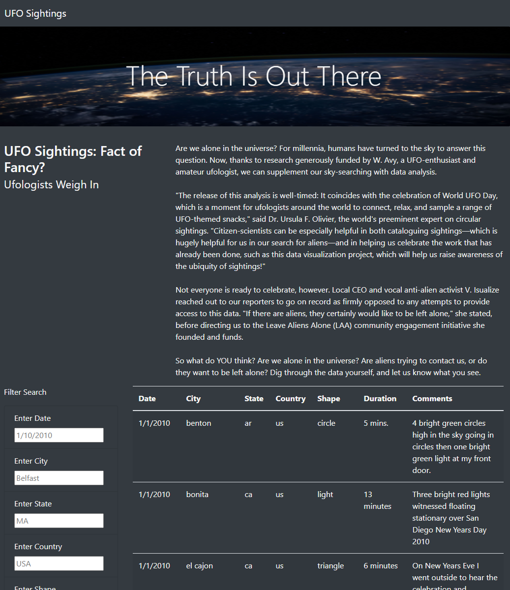

# UFOs

The project aims to complete a web-based searchable database of UFO sightings in different locations globally.

# The technologies used included:

- javascript,
- css,
- bootstrap
- HTML

The project was fun and lighthearted but it allowed me to practice javascript functions, loops and dynamic tables.

# Recommendation:
Include webscraping of available information to regularly update the data in the website.

A sample of how the website looks is below:

